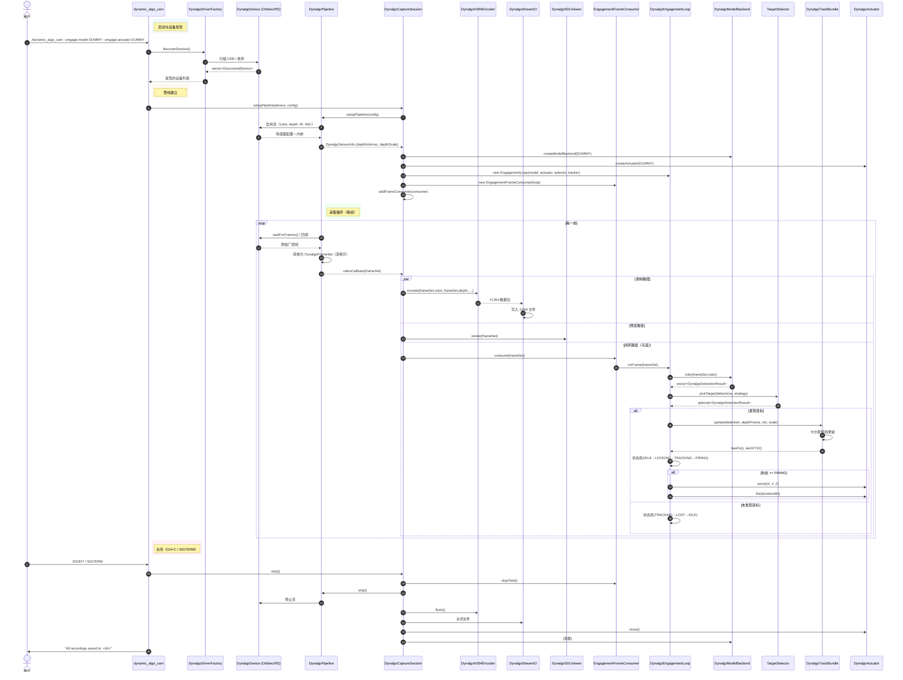

# DynamicAlgoCam

DynamicAlgoCam 是一个基于双目相机和激光雷达相机的动态算法加载框架，提供统一的感知与执行平台。支持模块化算法加载、运行时任务切换、视觉-激光雷达融合。

**核心能力：**

- 模块化算法加载，支持运行时任务切换
- 视觉 + 激光雷达融合，实现高精度目标检测与环境感知
- 面向特定任务场景（如灭蚊、除草、巡检）快速部署与验证
- 事件驱动录制，支持 IMU 对齐深度
- 感知→定位→估计→控制 闭环（Phase C）

## 支持设备

| 设备 | VID | 传感器 | 输出文件 |
|---|---|---|---|
| Orbbec Gemini 305 | `2bc5:0840` | Color, Depth, IR L+R | `.h264`, `.raw`, 融合 `.h264` |
| Orbbec Gemini 335L | `2bc5:0804` | Color, Depth, IR L+R, IMU | `.h264`, `.raw`, `.txt`, 融合 `.h264` |
| Orbbec Gemini 336L | `2bc5:0807` | Color, Depth, IR L+R, IMU | `.h264`, `.raw`, `.txt`, 融合 `.h264` |
| RoboSense RS-AC1 | `3840:1010` | Color, Depth (点云), Point Cloud | `.h264`, `.raw`, 融合 `.h264`, `*_point_raw_*.raw` |

详细硬件规格、流配置、输出格式差异见 [docs/device_comparison.md](docs/device_comparison.md)。

## 架构

DynamicAlgoCam 采用**分层架构**，依赖方向严格向下。厂商 SDK 头文件仅限驱动层使用，上层均为 SDK 无关设计。

```
┌──────────────────────────────────────────────────────────────────────────────────────┐
│                              dynamic_algo_cam（可执行文件）                           │
│                                                                                      │
│  入口：CLI 解析 → 设备发现 → 会话建立 → 帧流水线 →                                    │
│  可选闭环（Phase C）→ SIGINT/SIGTERM 优雅退出                                         │
├──────────────────────────────────────────────────────────────────────────────────────┤
│                              算法层（Phase C）                                        │
│                          ┌─────────────────────────────────┐                         │
│  dynalgo_algo            │  DynalgoEngagementLoop          │  --engage-model         │
│  （静态库）               │  ┌───────────┐ ┌───────────┐   │  --engage-actuator      │
│                          │  │ IDLE      │→│ LOCKING   │   │                         │
│                          │  └───────────┘ └───────────┘   │  状态机：               │
│                          │       ↑               ↓         │  感知→定位→估计→控制    │
│                          │  ┌───────────┐ ┌───────────┐   │                         │
│                          │  │ LOST      │←│ FIRING    │   │  阈值：                 │
│                          │  └───────────┘ └───────────┘   │  LOCKING→TRACKING=3帧   │
│                          │       ↑               ↓         │  TRACKING→LOST=5帧      │
│                          │  ┌───────────┐ ┌───────────┐   │  FIRING 冷却=1000ms     │
│                          │  │ IDLE      │←│ TRACKING  │   │                         │
│                          │  └───────────┘ └───────────┘   │                         │
│                          └─────────────────────────────────┘                         │
│                                                                                      │
│  ┌──────────────────────┐  ┌──────────────────────┐  ┌────────────────────────┐     │
│  │ TargetSelector        │  │ TrackBundle           │  │ DummyModelBackend     │     │
│  │ (pickTarget)          │  │ (卡尔曼滤波+3D缓存)   │  │ (DUMMY 自注册)        │     │
│  │                        │  │                        │  │                        │     │
│  │ 策略：                 │  │ 6维匀速模型            │  │ 生成帧中心合成检测     │     │
│  │ • HIGHEST_SCORE        │  │ [cx,cy,w,h,vx,vy]     │  │ 用于 dry-run 测试      │     │
│  │ • NEAREST_DEPTH        │  │ init/update/predict    │  │                        │     │
│  │ • LARGEST_AREA         │  │                        │  │                        │     │
│  └──────────────────────┘  └──────────────────────┘  └────────────────────────┘     │
│                                                                                      │
│  ┌──────────────────────┐  ┌──────────────────────┐  ┌────────────────────────┐     │
│  │ EngagementFrameConsumer│ │ DynalgoModelBackend   │  │ DynalgoKalmanTracker  │     │
│  │ (FrameConsumer)       │  │ (抽象接口)             │  │ (app/core)            │     │
│  │                        │  │                        │  │                        │     │
│  │ consume(shared_ptr     │  │ 类型：NONE, DUMMY,    │  │ 6维卡尔曼滤波          │     │
│  │   <DynalgoFrameSet>)   │  │ YOLOV8_PY,            │  │ [cx,cy,w,h,vx,vy]     │     │
│  │ → loop_->onFrame()     │  │ ONNXRUNTIME, TENSORRT │  │ init/update/predict   │     │
│  └──────────────────────┘  └──────────────────────┘  └────────────────────────┘     │
├──────────────────────────────────────────────────────────────────────────────────────┤
│                           采集层（dynalgo_capture）                                  │
│                                                                                      │
│  ┌──────────────────────┐  ┌──────────────────────┐  ┌────────────────────────┐     │
│  │ DynalgoCaptureSession │  │ DynalgoCaptureConfig  │  │ DynalgoFrameConsumer  │     │
│  │                        │  │                        │  │ (抽象接口)             │     │
│  │ • setupPipeline()      │  │ • CLI 参数解析          │  │                        │     │
│  │ • depthIntrinsic()     │  │ • D2C profile 选择     │  │ consume(FrameSet)     │     │
│  │ • depthScale()         │  │ • --engage-* 选项       │  │ stopTask()            │     │
│  │ • addFrameConsumer()   │  │                        │  │                        │     │
│  │ • setEngagementLoop()  │  │ DynalgoFrameQueue      │  │                        │     │
│  └──────────────────────┘  │ DynalgoStreamTasks      │  └────────────────────────┘     │
│                            │ DynalgoH264Encoder      │                                 │
│  DynalgoSDLViewer          │ DynalgoStreamIO          │  事件驱动录制：               │
│  DynalgoColorConvert       │ EventWindow              │  ENABLE_EVENT_SIM → EventSim   │
│  （可选 OpenCV 插件）       │ eventSink lambda         │                                │
│                            └──────────────────────┘                                 │
├──────────────────────────────────────────────────────────────────────────────────────┤
│                           执行器层（dynalgo_actuators）                               │
│                          ┌─────────────────────────────────┐                         │
│  dynalgo_actuators       │  DynalgoActuator（抽象基类）     │  --engage-actuator      │
│  （静态库）               │  ┌────────────────────────────┐ │                         │
│                          │  │ config(): dryRun, device,  │ │  类型：NONE, DUMMY,     │
│                          │  │ channel, ip, port, baud    │ │  LASER_GENERIC,         │
│                          │  └────────────────────────────┘ │  GIMBAL_GENERIC          │
│                          │                                  │                         │
│                          │  DummyActuator（全空操作）        │  安全：dryRun 默认 true  │
│                          │  通过 registerActuator()         │                         │
│                          │  静态初始化自注册                  │                         │
│                          └─────────────────────────────────┘                         │
├──────────────────────────────────────────────────────────────────────────────────────┤
│                           驱动层（dynalgo_drivers）                                   │
│                          ┌─────────────────────────────────┐                         │
│  dynalgo_drivers         │  DynalgoDevice（抽象接口）        │                         │
│  （静态库）               │  DynalgoPipeline（抽象接口）      │                         │
│                          │  DynalgoContext（抽象接口）        │                         │
│                          │  DynalgoDriverFactory             │                         │
│                          └─────────────────────────────────┘                         │
│                                                                                      │
│  ┌──────────────────────┐  ┌──────────────────────┐                                │
│  │ Orbbec 适配器         │  │ RoboSense 适配器      │                                │
│  │ (ENABLE_ORBBEC)       │  │ (ENABLE_RS_AC1)       │                                │
│  │                        │  │                        │                                │
│  │ DynalgoObDevice       │  │ DynalgoRsDevice       │                                │
│  │ DynalgoObAdapter      │  │ DynalgoRsAdapter      │                                │
│  │ DynalgoObFrameAdapter │  │ DynalgoRsFrameAdapter │                                │
│  │ DynalgoObSpec         │  │ DynalgoRsSpec         │                                │
│  │ DynalgoObValidator    │  │ DynalgoRsValidator    │                                │
│  └──────────────────────┘  └──────────────────────┘                                │
│                                                                                      │
│  厂商 SDK 隔离：OrbbecSDK 头文件 → 仅限 app/driver/orbbec/                           │
│                  rs_driver 头文件  → 仅限 app/driver/robosense/                      │
├──────────────────────────────────────────────────────────────────────────────────────┤
│                            核心层（dynalgo_core）                                     │
│                          ┌─────────────────────────────────┐                         │
│  dynalgo_core            │  SDK 无关类型与接口               │  无厂商依赖             │
│  （静态库）               │  无 OrbbecSDK / rs_driver        │                         │
│                          └─────────────────────────────────┘                         │
│                                                                                      │
│  类型：  DynalgoFrameType, DynalgoFormat, DynalgoIntrinsic, DynalgoAlignMode        │
│  帧：    DynalgoFrame, DynalgoFrameSet（getFrame 访问器）                            │
│  抽象：  DynalgoDevice, DynalgoPipeline, DynalgoContext                             │
│  模型：  DynalgoModelBackend, DynalgoModelConfig, DynalgoDetectionResult            │
│  执行器：DynalgoActuator, DynalgoActuatorConfig, DynalgoActuatorType                │
│  工厂：  createModelBackend(), createActuator()（自注册）                             │
│  基础：  DYNALGO_LOG_*, signalHandler(), mkdirp(), getTimestampMs()                 │
│  算法：  DynalgoKalmanTracker（6维 KF）, detectionCenterToCamera3D()                │
└──────────────────────────────────────────────────────────────────────────────────────┘

厂商 SDK（非 C++ 构建的一部分，链接时引入）：
  vendors/OrbbecSDK/   →  libOrbbecSDK.so   （链接到 dynalgo_drivers）
  vendors/RoboSense/   →  libusb / libuvc   （静态链接到 dynalgo_drivers）

可选插件（条件编译）：
  dynalgo_opencv_plugin →  dynalgo_capture + dynalgo_core + OpenCV  （如果找到 OpenCV）
  app/models/           →  YOLOv8（Python，不由 CMake 构建，GPL-3.0 许可证）
```

### 设计原则

- **严格分层**：依赖方向仅向下。上层从不直接引用厂商 SDK。
- **厂商隔离**：OrbbecSDK 和 rs_driver 头文件限制在 `app/driver/<vendor>/`。其他所有代码通过 `DynalgoDevice` / `DynalgoPipeline` / `DynalgoContext` 抽象接口通信。
- **自注册**：模型后端和执行器在静态初始化时通过 `registerModelBackend()` / `registerActuator()` 自注册。新后端只需添加到对应静态库的 CMakeLists.txt。
- **Dry-run 安全**：执行器 `dryRun` 默认 true。所有控制操作默认为空操作，直到显式启用。

### 数据流

```
设备（USB）
    │
    ▼
驱动层（Orbbec / RoboSense）
    │  原始帧：COLOR, DEPTH, IR_L, IR_R, IMU, POINT
    ▼
采集会话
    │  ├── FrameQueue → StreamTasks → H264Encoder → StreamIO（文件）
    │  ├── SDLViewer（预览）
    │  └── FrameConsumer 链（可选）
    │         │
    │         ▼
    │    EngagementFrameConsumer
    │         │
    │         ▼
    │    EngagementLoop.onFrame()
    │         │
    │         ├── TargetSelector.pickTarget(detections, strategy)
    │         ├── TrackBundle.init/update（卡尔曼滤波）
    │         ├── detectionCenterToCamera3D() → 3D 修正
    │         └── Actuator.fire()（如果状态 == FIRING）
    │
    ▼
输出文件（.h264, .raw, .txt, .csv）
```

### app/ 目录结构

`app/` 目录包含所有 C++ 源代码，采用**严格分层架构**，依赖方向仅向下：

```
app/
├── core/                    # 核心层
│   ├── dynalgo_*_factory.*  # 工厂 + 自注册
│   ├── dynalgo_*.hpp        # Frame, Types, Model, Actuator, Device 抽象
│   └── utils*               # 日志、时间戳、线程工具
│
├── driver/                  # 驱动层
│   ├── orbbec/              # OrbbecSDK 适配
│   ├── robosense/           # RoboSense rs_driver 适配
│   └── stereo/              # 双目相机抽象（可选）
│
├── capture/                 # 采集层
│   ├── dynalgo_capture_session.*    # 会话编排
│   ├── dynalgo_h264_encoder.*       # H.264 编码
│   ├── dynalgo_stream_io.*          # 文件写入
│   ├── dynalgo_frame_queue.*        # 无锁 SPSC 队列
│   ├── dynalgo_stream_tasks.*       # 流任务管理
│   ├── dynalgo_sdl_viewer.*         # SDL 预览
│   ├── dynalgo_color_convert.*      # 色彩空间转换
│   └── dynalgo_frame_consumer.*     # FrameConsumer 链
│
├── algo/                    # 算法层 — 可选
│   ├── bytetrack/           # ByteTrack 多目标跟踪
│   ├── sahi/                # SAHI 切片推理（小目标）
│   ├── dynalgo_engagement_loop.*    # 感知→定位→估计→控制
│   ├── dynalgo_engagement_consumer.*
│   ├── dynalgo_target_selector.*    # 目标选择策略
│   ├── dynalgo_track_bundle.*       # 卡尔曼 + 3D 缓存
│   └── dummy_model_backend.*        # Dry-run 模型桩
│
├── model_backends/          # 推理后端 — 可选 (ENABLE_MODEL_BACKENDS)
│   ├── common/              # 共享预处理、NMS、后处理
│   ├── tensorrt/            # TensorRT C++ 后端
│   ├── onnxruntime/         # ONNX Runtime C++ 后端
│   └── rknn/                # RKNN Runtime C++ 后端
│
├── actuator/                # 执行器层 — 可选 (--engage-actuator)
│   ├── dynalgo_actuator.*   # 抽象接口
│   ├── dummy_actuator.*     # Dry-run 实现
│   └── CMakeLists.txt
│
├── dynamic_algo_cam/        # 主可执行程序入口
│   └── dynamic_algo_cam.cpp
│
├── plugins/                 # 可选插件
│   └── opencv/              # OpenCV 色彩转换插件
│
├── models/                  # Python 模型包（不参与 CMake 构建）
│   └── yolov8/              # Ultralytics YOLOv8 (GPL-3.0)
│
├── training/                # Python 训练流水线（不参与 CMake 构建）
│   ├── scripts/             # 训练、导出、验证、转换
│   └── configs/             # YOLOv11 蚊虫/杂草、RT-DETR 配置
│
└── tools/                   # Python 后处理工具
    └── parse_*.py, stream_*.py, evaluate_*.py
```

**依赖流向（严格单向向下）：**

```
dynamic_algo_cam
       │
       ▼
┌──────────────────┐
│  capture + algo  │  ← 依赖 core + actuator
└────────┬─────────┘
         │
         ▼
┌──────────────────┐
│     driver       │  ← 依赖 core
└────────┬─────────┘
         │
         ▼
┌──────────────────┐
│      core        │  ← 零厂商依赖
└──────────────────┘
```

**关键原则：**
- **厂商隔离**：OrbbecSDK / rs_driver 头文件仅限 `app/driver/<vendor>/`
- **自注册**：模型后端与执行器在静态初始化时通过工厂钩子自注册
- **Dry-run 安全**：`dryRun=true` 默认；所有控制动作默认为空操作，显式启用前无副作用
- **可选层**：`algo/`、`model_backends/`、`actuator/`、`driver/stereo/` 仅在对应 CMake 选项或 CLI 参数启用时链接

### UML 时序图

下图展示启用闭环（`--engage-model DUMMY --engage-actuator DUMMY`）时的关键交互流程：



> **注意**：仅当同时提供 `--engage-model` 和 `--engage-actuator` 时，闭环路径才会激活。未提供这些参数时，`FrameConsumer` 链为空，采集会话行为与基线版本完全一致（零开销）。

## 构建

### 前置依赖

| 依赖 | 必需 | 来源 |
|---|---|---|
| CMake >= 3.10 | 是 | 系统包 |
| C++14 编译器（C++17 用于算法层） | 是 | GCC / Clang |
| FFmpeg (libavcodec, libavutil, libswscale, libavformat, libswresample) | 是 | pkg-config |
| SDL2 | 是 | pkg-config |
| pthreads | 是 | 系统 |
| OpenCV | 否 | 可选 — 启用 `dynalgo_opencv_plugin` |
| GTest | 否 | 可选 — 启用 `tests/`（如果 `BUILD_TESTS=ON`） |

### 厂商 SDK 选项

选项在**根** `CMakeLists.txt` 中声明。至少需要一个 ON。

| CMake 选项 | 默认值 | 效果 |
|---|---|---|
| `ENABLE_ORBBEC` | ON | 构建 OrbbecSDK 适配器，链接 `ob::OrbbecSDK` |
| `ENABLE_RS_AC1` | ON | 构建 rs_driver 适配器，链接 `usb-ac-static` / `uvc-ac-static` |

### 模型后端选项

选项在 `app/model_backends/CMakeLists.txt` 中声明。这些是可选的，需要相应的 SDK 支持。

| CMake 选项 | 默认值 | 效果 |
|---|---|---|
| `ENABLE_MODEL_BACKENDS` | OFF | 启用模型推理后端 |
| `ENABLE_TENSORRT` | OFF | 构建 TensorRT 后端（需要 CUDA + TensorRT SDK） |
| `ENABLE_ONNXRUNTIME` | OFF | 构建 ONNX Runtime 后端（需要 ONNX Runtime SDK） |
| `ENABLE_RKNN` | OFF | 构建 RKNN 后端（需要 Rockchip RKNN SDK） |

### CUDA 加速选项

选项在 `app/model_backends/common/CMakeLists.txt` 和根 `CMakeLists.txt` 中声明。这些启用 GPU 加速的预处理和 NMS。

| CMake 选项 | 默认值 | 效果 |
|---|---|---|
| `ENABLE_CUDA` | OFF | 启用 CUDA 加速预处理和 NMS（需要 CUDA Toolkit） |

当 `ENABLE_CUDA=ON` 时，以下操作在 GPU 上加速：
- **预处理**：Letterbox 缩放 + BGR→RGB 转换 + 归一化 + HWC→CHW 布局转换
- **NMS（非极大值抑制）**：并行 IoU 计算，共享内存优化

### 双目相机选项

选项在 `app/driver/stereo/CMakeLists.txt` 中声明。这些启用双目相机支持。

| CMake 选项 | 默认值 | 效果 |
|---|---|---|
| `ENABLE_STEREO` | OFF | 启用双目相机支持（包含 ENABLE_STEREO_UVC） |
| `ENABLE_STEREO_UVC` | ON | 启用通用 UVC 双目相机驱动 |
| `ENABLE_ZED` | OFF | 启用 Stereolabs ZED SDK 支持 |
| `ENABLE_MYNT_EYE` | OFF | 启用 MYNT EYE SDK 支持 |
| `ENABLE_DEPTHAI` | OFF | 启用 Luxonis DepthAI/OAK 支持 |

当 `ENABLE_STEREO=ON` 时，双目驱动层将构建支持：
- 通用 UVC 双目相机（双 UVC 设备）
- 从 OpenCV YAML/XML 加载标定
- 双目校正（去畸变 + 矫正）
- SGBM 双目匹配生成视差/深度

### 构建步骤

```bash
mkdir -p build && cd build

# 默认：两个厂商都启用
cmake ..

# 仅 Orbbec
cmake .. -DENABLE_RS_AC1=OFF

# 仅 RS-AC1
cmake .. -DENABLE_ORBBEC=OFF

# 启用 TensorRT 后端（需要 CUDA + TensorRT SDK）
cmake .. -DENABLE_MODEL_BACKENDS=ON -DENABLE_TENSORRT=ON

# 启用 ONNX Runtime 后端
cmake .. -DENABLE_MODEL_BACKENDS=ON -DENABLE_ONNXRUNTIME=ON

# 启用 RKNN 后端（需要 Rockchip RKNN SDK）
cmake .. -DENABLE_MODEL_BACKENDS=ON -DENABLE_RKNN=ON

# 启用所有后端
cmake .. -DENABLE_MODEL_BACKENDS=ON -DENABLE_TENSORRT=ON -DENABLE_ONNXRUNTIME=ON -DENABLE_RKNN=ON

# 启用 CUDA 加速预处理/NMS
cmake .. -DENABLE_CUDA=ON -DENABLE_MODEL_BACKENDS=ON -DENABLE_TENSORRT=ON

# 启用所有后端 + CUDA 加速
cmake .. -DENABLE_CUDA=ON -DENABLE_MODEL_BACKENDS=ON -DENABLE_TENSORRT=ON -DENABLE_ONNXRUNTIME=ON -DENABLE_RKNN=ON

# 启用双目相机支持
cmake .. -DENABLE_STEREO=ON

# 启用双目 + CUDA + TensorRT
cmake .. -DENABLE_STEREO=ON -DENABLE_CUDA=ON -DENABLE_MODEL_BACKENDS=ON -DENABLE_TENSORRT=ON

cmake --build . -j$(nproc)
```

可执行文件为 `build/bin/dynamic_algo_cam`。使用 `cmake --install .` 安装（安装到 `bin/`）。

### 运行时库路径

OrbbecSDK 提供 `libOrbbecSDK.so`。安装到系统路径或设置：
```bash
export LD_LIBRARY_PATH=/path/to/orbbeccamera/build/linux_x86_64/lib:$LD_LIBRARY_PATH
```

RS-AC1 依赖静态链接 — 运行时无需 `.so`。

## 使用方法

```bash
# 录制所有连接设备
./dynamic_algo_cam

# 按设备名子串过滤
./dynamic_algo_cam -c "305" "336L"

# 自定义保存目录
./dynamic_algo_cam -s /HDD/dynalgo_capture

# 调整 D2C 融合参数
./dynamic_algo_cam --alpha 0.7 --depth-min 0.2 --depth-max 3.0

# 无头模式（不显示 SDL 窗口）
./dynamic_algo_cam --no-show

# 禁用 D2C 融合输出
./dynamic_algo_cam --no-fusion

# Dry-run 闭环（DUMMY 模型 + DUMMY 执行器）
./dynamic_algo_cam --engage-model DUMMY --engage-actuator DUMMY --no-show

# Dry-run 启用合成事件
./dynamic_algo_cam --engage-model DUMMY --engage-actuator DUMMY --enable-event-sim

# 启用 TensorRT 后端的闭环
./dynamic_algo_cam --engage-model TENSORRT --engage-actuator DUMMY --engage-model-path model.engine --no-show

# 启用 ONNX Runtime 后端的闭环
./dynamic_algo_cam --engage-model ONNXRUNTIME --engage-actuator DUMMY --engage-model-path model.onnx --no-show

# 启用 RKNN 后端的闭环
./dynamic_algo_cam --engage-model RKNN --engage-actuator DUMMY --engage-model-path model.rknn --no-show

# 双目相机采集（带标定）
./dynamic_algo_cam --stereo-config stereo_calib.yaml --stereo-compute-depth --no-show
```

### CLI 参数

| 参数 | 默认值 | 说明 |
|---|---|---|
| `-c <name...>` | 所有设备 | 按设备名子串过滤 |
| `-s <dir>` | `capture_output/` | 保存目录 |
| `--alpha VAL` | 0.5 | 深度叠加透明度（0=原始彩色，1=深度着色） |
| `--depth-min M` | 0.3 | jet colormap 最小深度（米） |
| `--depth-max M` | 5.0 | jet colormap 最大深度（米） |
| `--no-fusion` | 关 | 跳过 D2C 融合输出 |
| `--no-show` | 关 | 禁用 SDL 预览窗口 |
| `--engage-model TYPE` | （空） | 模型后端：NONE, DUMMY, YOLOV8_PY, ONNXRUNTIME, TENSORRT, RKNN |
| `--engage-actuator TYPE` | （空） | 执行器后端：NONE, DUMMY, LASER_GENERIC, GIMBAL_GENERIC |
| `--engage-model-path PATH` | （空） | 模型权重路径（非 DUMMY 后端使用） |
| `--help` | — | 显示帮助 |

### 输出结构

```
<saveDir>/<sessionTimestamp>/<deviceName>/
├── <name>_color_<ts>.h264
├── <name>_depth_<ts>.h264
├── <name>_depth_raw_<ts>.raw
├── <name>_ir_left_<ts>.h264     （仅 Orbbec）
├── <name>_ir_right_<ts>.h264    （仅 Orbbec）
├── <name>_imu_<ts>.txt          （设备有 IMU 时）
├── <name>_d2c_fused_<ts>.h264   （启用融合时）
└── <name>_point_raw_<ts>.raw    （仅 RS-AC1）
```

### 停止

`Ctrl+C` 或 `SIGTERM` 触发优雅退出：停止 SDK 管道 → 刷新编码器 → 关闭文件。

## 录制前准备

### USB 缓冲区（多设备必需）

```bash
# 查看当前值
cat /sys/module/usbcore/parameters/usbfs_memory_mb

# 设置为 256 MB（临时）
echo 256 | sudo tee /sys/module/usbcore/parameters/usbfs_memory_mb

# 永久生效
echo "options usbcore usbfs_memory_mb=256" | sudo tee /etc/modprobe.d/usbcore.conf
```

### udev 规则（Orbbec）

```bash
sudo cp vendors/OrbbecSDK/scripts/99-obsensor-usb.rules /etc/udev/rules.d/
sudo udevadm control --reload-rules && sudo udevadm trigger
```

### RS-AC1 USB 解绑（必需）

RS-AC1 使用自定义 libuvc。必须解绑内核 `uvcvideo` 驱动：

```bash
# 查找设备
lsusb | grep 3840:1010

# 解绑（替换为实际总线/设备路径）
echo '1-5' | sudo tee /sys/bus/usb/drivers/uvcvideo/unbind 2>/dev/null || true
```

## 后处理工具

```bash
# 深度原始数据解析
python3 app/tools/parse_depth_raw.py <file.raw> --stats
python3 app/tools/parse_depth_raw.py <file.raw> --output vis --all

# 点云原始数据解析（RS-AC1）
python3 app/tools/parse_point_raw.py <file.raw> --info
python3 app/tools/parse_point_raw.py <file.raw> --frame 0

# H.264 播放
ffplay -f h264 <file>.h264

# H.264 封装为 MP4
ffmpeg -y -fflags +genpts -r 30 -i <file>.h264 -c copy output.mp4
```

## 文档

| 文档 | 内容 |
|---|---|
| [docs/device_comparison.md](docs/device_comparison.md) | 硬件规格、流配置、输出格式差异 |
| [docs/VENDOR_DEVICE_PORTING_MANUAL.md](docs/VENDOR_DEVICE_PORTING_MANUAL.md) | 如何添加新厂商设备适配器 |
| [docs/dynamic_algo_cam/use_guide.md](docs/dynamic_algo_cam/use_guide.md) | 详细使用指南 |
| [docs/dynamic_algo_cam/troubleshooting.md](docs/dynamic_algo_cam/troubleshooting.md) | 故障排查参考 |
| [docs/dynamic_algo_cam/dynamic_algo_cam_technical_reference.md](docs/dynamic_algo_cam/dynamic_algo_cam_technical_reference.md) | 技术参考（架构、算法、数据格式） |
| [docs/dynamic_algo_cam/models_overview.md](docs/dynamic_algo_cam/models_overview.md) | `app/models/` 下的算法/推理模型包（布局、使用、许可证披露） |
| [docs/dynamic_algo_cam/DEVELOPMENT_PLAN.md](docs/dynamic_algo_cam/DEVELOPMENT_PLAN.md) | 开发计划（Phase A–D 里程碑） |
| [docs/dynamic_algo_cam/IMPLEMENTATION_TASKS.md](docs/dynamic_algo_cam/IMPLEMENTATION_TASKS.md) | 实现任务清单（含 commit hash） |

## 打包

```bash
./scripts/package.sh [--output DIR] [--skip-libs]
```

生成自包含的 tar.gz 包，包含二进制文件、SDK 库、udev 规则和启动脚本。

## 许可证

MIT 许可证。`vendors/` 下的厂商 SDK 见各自许可证。

### 嵌入模型包 — 附加许可证披露

本项目在 `app/models/` 下引入第三方算法/推理模型包。每个子目录包含其上游 `LICENSE`，**由该许可证管辖，而非本项目的 MIT 许可证**：

| 子目录 | 许可证 | 说明 |
|---|---|---|
| `app/models/yolov8/` | **GPL-3.0** ([`app/models/yolov8/LICENSE`](app/models/yolov8/LICENSE)) | GPL-3.0 **不兼容** MIT。任何包含 YOLOv8 源代码的分发都会触发 GPL-3.0 义务（对应源码可用性、通知传播、copyleft 条款）。移除或不使用 YOLOv8 代码可避免这些义务。 |

添加更多模型包的规则和理由见 [`app/models/README.md`](app/models/README.md)。
